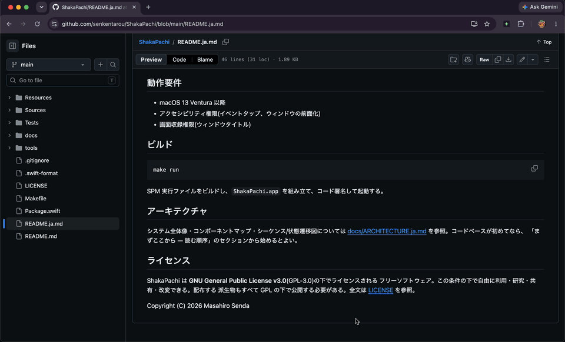
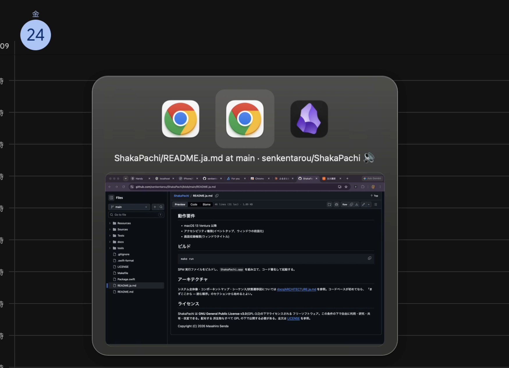

# ShakaPachi

[English](README.md) | **日本語**

macOS 向けの、高速なウィンドウ単位のスイッチャー。

macOS 標準の Cmd+Tab は*アプリケーション*単位の切り替え。ShakaPachi はこれを
*ウィンドウ*単位の切り替えに置き換える。トリガー修飾キーを押したまま、アプリ
アイコンとウィンドウタイトルの一覧を巡回し、離すとアクティブ化。既定では、選択中
のウィンドウのライブプレビューがタイトルの下に表示される(画面収録権限を許可した
場合)。設定でオフにすればテキストのみの一覧になる。

ウィンドウはアプリ単位でまとめて表示することもできる。設定の「表示単位」で
「アプリ単位」を選ぶ(既定は上記のフラット表示である「ウィンドウ単位」)。この
モードではトリガーキーがアプリ間を移動し、選択中のアプリが最大 3 枚のウィンドウ
プレビューの帯に展開される。それを超える分は `+n` バッジにまとまる。左右で今いる
段の中を移動、下でプレビュー帯へ降り、上でアプリの段へ戻る。トリガー修飾キーを
押したまま `1`〜`3` で表示中のペインへ直接飛べる。

これは macOS の Cmd+Tab に戻す機能ではない。あちらはアプリまでしか連れて行って
くれないが、こちらは最終的に 1 枚のウィンドウに着地する — フラットな一覧が長く
なったときに、そこへ短い道で着くための一段である。ウィンドウが 1 枚しかないアプリ
の見た目はこれまでと変わらない。

## デモ





## 特徴

- ウィンドウ単位の切り替え(同一アプリの複数ウィンドウも個別に一覧表示)
- アプリアイコン + ウィンドウタイトルに加え、選択中ウィンドウのライブプレビュー(既定でオン、設定でオフに切り替え可能)
- 表示単位を選択可能: ウィンドウ単位(既定)またはアプリ単位(展開式のプレビュー帯と直接ジャンプ操作つき)
- 並び順を選択可能: 最近使った順 (MRU)、Z オーダー、アプリ別、最近使ったアプリ順
- メニューバー常駐、Dock アイコンなし
- 安全機構: 緊急停止ホットキー(Ctrl+Option+Cmd+Esc)と、自動停止のデッドマンスイッチ
- テーマ、アクセントカラー、利用統計(任意)

## 動作要件

- macOS 13 Ventura 以降
- アクセシビリティ権限(イベントタップ、ウィンドウの前面化)
- 画面収録権限(ウィンドウタイトルとライブプレビュー)

## ビルド

```
make run
```

SPM 実行ファイルをビルドし、`ShakaPachi.app` を組み立て、コード署名して起動する。

## アーキテクチャ

システム全体像・コンポーネントマップ・シーケンス/状態遷移図については
[docs/ARCHITECTURE.ja.md](docs/ARCHITECTURE.ja.md) を参照。コードベースが初めてなら、
「まずここから — 読む順序」のセクションから始めるとよい。

## ライセンス

ShakaPachi は **GNU General Public License v3.0**(GPL-3.0)の下でライセンスされる
フリーソフトウェア。この条件の下で自由に利用・研究・共有・改変できる。配布する
派生物もすべて GPL の下で公開する必要がある。全文は [LICENSE](LICENSE) を参照。

Copyright (C) 2026 Masahiro Senda
