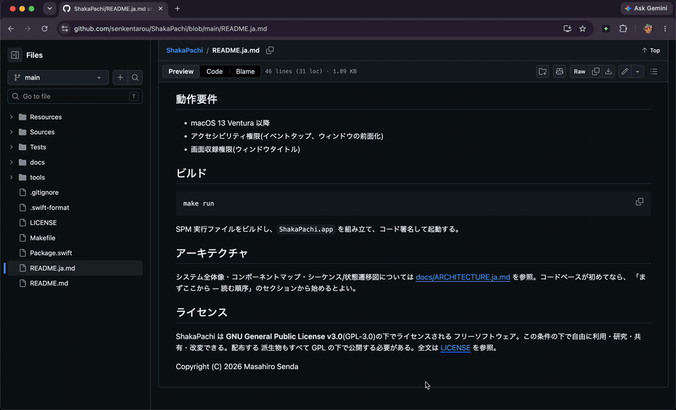
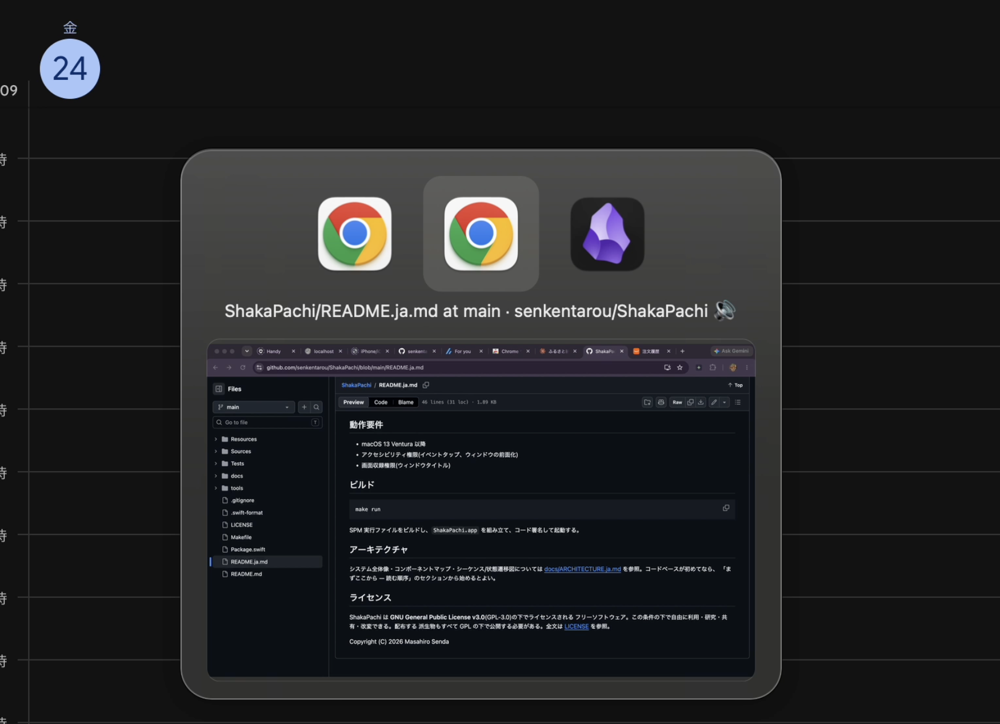

# ShakaPachi

**English** | [日本語](README.ja.md)

A fast, window-level switcher for macOS.

macOS's built-in Cmd+Tab switches between *applications*. ShakaPachi replaces it
with *window*-level switching: hold the trigger modifier, cycle through a list of
app icons and window titles, release to activate. The selected window's live
preview is shown below its title by default (when Screen Recording permission is
granted); turn it off in Settings for a pure text list.

## Demo






## Features

- Window-level switching (multiple windows of the same app are listed individually)
- App icon + window title, plus a live preview of the selected window (on by default; toggleable off in Settings)
- Selectable ordering: MRU (most recently used), Z-order, per-app, and recently-used-app order
- Menu bar resident, no Dock icon
- Safety: emergency stop hotkey (Ctrl+Option+Cmd+Esc) and an auto-stop deadman switch
- Optional themes, accent colors, and usage stats

## Requirements

- macOS 13 Ventura or later
- Accessibility permission (event tap, window raising)
- Screen Recording permission (window titles and the live preview)

## Build

```
make run
```

Builds the SPM executable, assembles `ShakaPachi.app`, codesigns it, and launches it.

## Architecture

See [docs/ARCHITECTURE.md](docs/ARCHITECTURE.md) for a full system overview, component map, and sequence/state diagrams. New to the codebase? Start with its "Start here — reading order" section.

## License

ShakaPachi is free software licensed under the **GNU General Public License v3.0**
(GPL-3.0). You are free to use, study, share, and modify it under those terms;
any distributed derivative work must also be released under the GPL. See
[LICENSE](LICENSE) for the full text.

Copyright (C) 2026 Masahiro Senda
