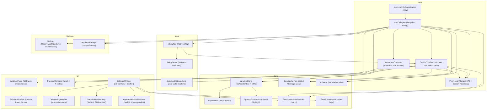
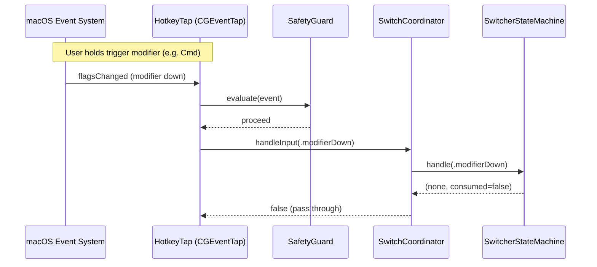
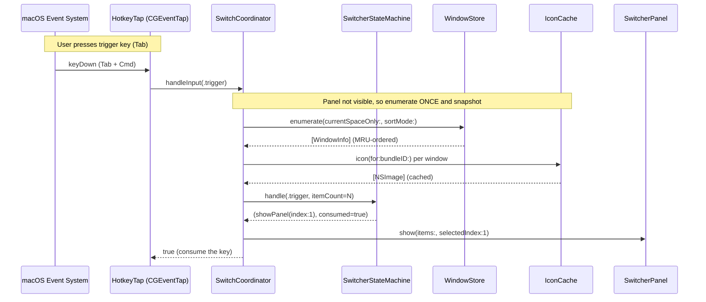
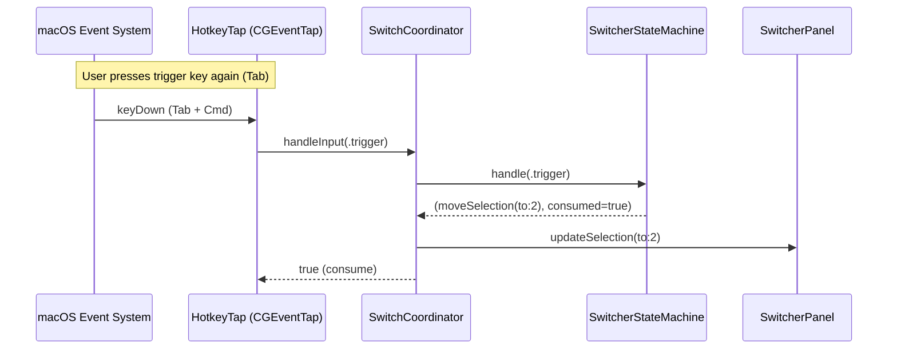
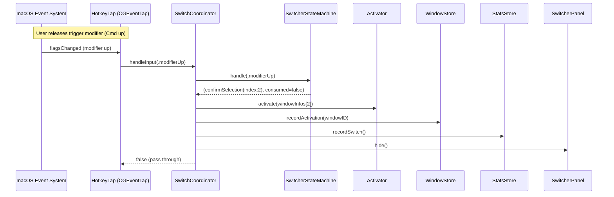
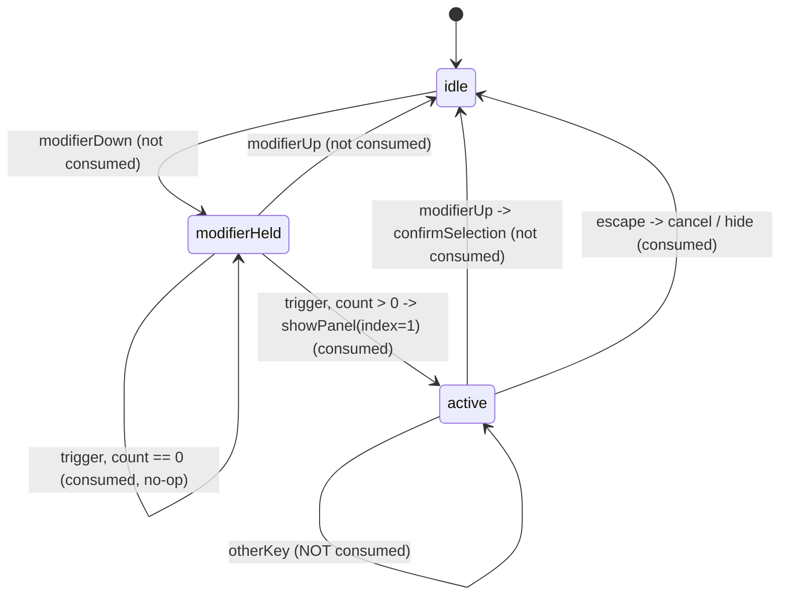

# ShakaPachi — アーキテクチャ

[English](ARCHITECTURE.md) | **日本語**

本ドキュメントは、Swift と macOS アプリ開発が初めての人に向けて書かれている。
アプリが何をするのか、ソースをどの順序で読むべきか、各部品がどう組み合わさるのか
を説明する。macOS の込み入った小技は末尾に隔離してあり、そこを読まなくてもアプリ
全体を理解できる。

## 概要

ShakaPachi は macOS 向けの **ウィンドウ単位の Cmd+Tab 置き換え**。macOS 標準の
Cmd+Tab は*アプリケーション*間を切り替えるが、ShakaPachi は個々の*ウィンドウ*間を
切り替える。修飾キー(既定は Cmd)を押したままトリガーキー(Tab)をタップすると、
アプリアイコンのタイル列がフロート表示される — 画面上のウィンドウごとに 1 枚、
最近使った順に並ぶ。タップを続けるとハイライトが移動し、修飾キーを離すとハイライト
されたウィンドウが前面化する。

すべてメニューバー内で動作し、Dock アイコンは表示しない。速度が最優先の設計目標
であり、タイルにはアプリアイコンとウィンドウタイトルのみを表示する(選択中ウィンドウ
のライブプレビューは設定で任意に有効化できる)。アプリは macOS 13+ を対象とする
単一の Swift Package Manager 実行ファイル。

---

## まずここから — 読む順序

このコードベースが初めてなら、以下の順序でファイルを読むとよい。各行に何を期待
すべきかを記したので、いま何を見ているのか把握できる。

1. **`main.swift`** — エントリポイント。3 行だけ: アプリを生成し、デリゲートを
   取り付け、実行する。これが SwiftUI 主体ではなく素の AppKit アプリであること
   を確認できる。
2. **`App/AppDelegate.swift`** — **配線図**。起動時にアプリの全パーツを一度生成し、
   相互に接続する。ライフサイクル(権限、メニューバー項目、ライブ設定)も管理する。
   直近のリファクタリング後、切り替えロジックは*一切*持たない — 組み立てて引き渡す
   だけ。
3. **`App/SwitchCoordinator.swift`** — **中核**。Cmd+Tab を押してからウィンドウが
   前面に出るまでに「何が起きるか」を上から下へ読める 1 ファイル。まずヘッダー
   コメントから読むとよい。実行時の挙動を単一ファイルで理解する最良の入門になる。
   `AppDelegate` がこのオブジェクトを構築し、すべてのキーイベントをその
   `handleInput(_:t0:)` メソッドへ流し込む。
4. **純ロジックのファイル群**(AppKit 非依存で、単体で簡単にユニットテストできる):
   - **`Input/SwitcherStateMachine.swift`** — 各キー押下が*何を意味するか*(表示・
     移動・確定・取り消し)を決める小さなステートマシン (state machine)(idle →
     held → active)。ウィンドウも描画もなし — 状態と遷移だけ。
   - **`Input/SafetyGuard.swift`** — アプリがユーザーの邪魔にならないよう退避すべき
     タイミング(緊急停止、セキュア入力、タップ復旧)を決めるステートレスな規則。
     enum を返す純粋関数。
   - **`Core/StreakStats.swift`** — 利用ストリーク/ヒートマップのための純粋な計算。
     ウィンドウ切り替えとは無関係なので、最後にざっと目を通せば十分。
5. **UI パーツ** — `UI/SwitcherPanel`(フロートウィンドウ)、加えて
   `UI/SettingsWindow`・`UI/OnboardingWindow`・カスタム描画のビュー群。上記の流れ
   を理解した後に読むとよい。これらはコーディネーターとデリゲートに*駆動される*側
   であり、その逆ではない。

残りの `Core/`(`WindowStore`・`Activator`・`SpacesEnumerator`・`IconCache`)は、
コーディネーターが駆動する機構。`WindowStore` と `Activator` は読む価値がある。
`SpacesEnumerator` とプライベート API の詳細は **上級編** のセクションで扱うので、
最初は飛ばしてよい。

---

## Swift の並行性アノテーションの読み方

エントリファイルの至るところでこれらのアノテーションを目にする。最初に読むときは、
コンパイラがスレッド安全性について安心させられているだけと捉えてよい — 実際の挙動
はこれらのラベルではなくメソッド本体にある。読み飛ばせるよう、各アノテーションの
意味を示す。

| アノテーション | かみ砕いた意味 | 最初に読むとき |
|---|---|---|
| `@MainActor` | メイン(UI)スレッドで動作する | 「これはメインスレッドのコードで、追加のスレッド管理は不要」と考える |
| `nonisolated` / `nonisolated(unsafe)` | メンバーをメインスレッド規則から除外する。`(unsafe)` は作者が手動で安全性を保証したという意味 | 飛ばしてよい。並行性のエスケープハッチ |
| `MainActor.assumeIsolated { }` | 「ここは既にメインスレッド上だから信じてくれ」 | 飛ばしてよい。コンパイラへの約束 |
| `@Sendable` / `@unchecked Sendable` | スレッド間で受け渡して安全。`unchecked` は作者が手動で保証したという意味 | 飛ばしてよい |
| `@propertyWrapper`(例: `DefaultsBool`・`DefaultsEnum`) | プロパティを自動で `UserDefaults` から読み書きさせる再利用可能なラッパー | 一度読んだら、ラップされたプロパティは普通の値として扱う |
| `nonmutating set` | 構造体を変更せず別の場所(UserDefaults)へ書き込むセッター | 飛ばしてよい。呼び出し側からは通常のプロパティと同じ挙動 |
| `[weak self]` | 循環参照を避けるための定番のクロージャ作法 | 飛ばしてよい |

これらのアノテーションが一切ない純ロジックを最初に見たいなら、
`SwitcherStateMachine`・`SafetyGuard`・`StreakStats` に直行するとよい。

---

## Cmd+Tab を押したときに何が起きるか

以下が全体の流れをかみ砕いた説明。いくつかの用語は初出時にその場で説明する。

1. **Cmd を押したまま。** 低レベルの*イベントタップ (event tap)*(`HotkeyTap` —
   フォーカス中のアプリより先にキーイベントを見るシステムフック)が修飾キーの押下
   を検知する。まだ目に見える変化はない。
2. **Tab をタップ。** イベントタップはこれを抽象的な「トリガー」入力に変換して
   コーディネーターへ渡す。コーディネーターは `WindowStore` に画面上の全ウィンドウを
   **一度だけ** 列挙するよう依頼し、それぞれのタイル(アプリアイコン + タイトル)を
   構築し、2 番目のウィンドウをあらかじめ選択した状態でフロートパネルを表示する —
   これにより、1 回のタップと解放で直前のウィンドウへ戻れる。
3. **Tab をタップし続ける(Cmd は押したまま)。** タップするたびにハイライトが 1 枚
   右へ移動し、末尾で先頭へ折り返す。Shift+Tab で左へ移動。矢印キーも使える。重要な
   のは、ウィンドウ一覧は**再構築されない**点 — パネルはステップ 2 で取った
   *スナップショット*を表示し続ける(後述の「なぜスナップショットを取るのか」を参照)。
4. **Cmd を離す。** これでハイライト中のウィンドウが確定する。コーディネーターは
   `Activator` にそれを前面化(最前面に持ってくる)するよう依頼し、次回に先頭へ並ぶ
   よう選択を記録し、切り替えカウンターを増やし、パネルを隠す。代わりに Escape を
   押すと取り消し — パネルが隠れるだけで、何も前面化されない。

**パネルが素早く戻ることは不可侵として扱わねばならない:** コーディネーターの
`handleInput` はメインスレッドのイベントタップコールバックの*内部*で動作し、システム
はこれがほぼ即座に返ることを期待している。そのため安価な処理(状態の参照と再描画
要求)だけを行い、決してブロックしない。その戻り値が、キーを*消費する*(前面アプリ
に届かないよう飲み込む)か通過させるかをタップに伝える。

---

## 階層化コンポーネントマップ

ボックスはフォルダごとにグループ化してある。`AppDelegate` がすべてを配線し、
`SwitchCoordinator` は低レベル入力と、それが駆動する切り替えサイクルのパーツとの
間に位置する。

**純ロジック**のパーツ(`SwitcherStateMachine`・`SafetyGuard`・`StreakStats`、加えて
`WindowStore` / `Activator` 内の静的ヘルパー)は AppKit 依存を持たないため、ディスプレイ
接続なしで直接ユニットテストできる。

---

## 切り替えサイクル(ホットパス)

トリガーから確定までの一連の流れを、フェーズごとに 4 つの小さな図で示す — 上記
「Cmd+Tab を押したときに何が起きるか」の 4 つの番号付きステップと 1:1 で対応する。
`SwitchCoordinator.handleInput` がオーケストレーター: `HotkeyTap` が関連する各キー
イベントごとにこれを呼び、ステートマシンが決めたことを実行する。

**フェーズ 1 — Cmd を押したまま(準備)。** トリガー修飾キーを押したままにする。タップは準備完了だが、まだ何も表示されない。

**フェーズ 2 — Tab をタップ(表示)。** Tab をタップする。コーディネーターはウィンドウを一度だけ列挙し、スナップショットを取り、2 番目のウィンドウをあらかじめ選択した状態でパネルを表示する。

**フェーズ 3 — Tab をタップし続ける(移動)。** Tab を再度タップする。既存のスナップショット上をハイライトが移動し、再列挙は行われない。

**フェーズ 4 — Cmd を離す(確定)。** 修飾キーを離す。コーディネーターはウィンドウを前面化し、それを記録し、カウンターを増やし、パネルを隠す。

### なぜ表示時にスナップショットを取るのか

パネルが最初に現れるとき、コーディネーターはウィンドウを**ちょうど一度だけ**列挙し、
その一覧をサイクルの残りにおける唯一の信頼できる情報源として保持する。2 つの派生
一覧が保存される:

- `lastWindowInfos` — 完全なウィンドウデータ。確定時に正確なウィンドウを前面化する
  ため、および同一アプリ内ジャンプのヘルパーが使う。
- `lastSwitcherItems` — パネルが描画する表示行。

どちらも同じウィンドウを同じ順序で記述するので、ハイライト中のインデックスは常に
両方に対して有効。もしキーを押すたびに再列挙していたら、サイクルの途中でウィンドウ
が開閉すると、ユーザーがまだ見ているパネルの足元でインデックスがずれてしまう。
一度だけ列挙することで、この種のバグ全体を回避し、各キー押下を安価に保つ。

---

## スイッチャーのステートマシン

`SwitcherStateMachine` は 3 状態を持つ、純粋で AppKit 非依存のクラス。*キー押下が
何を意味するか*を決め、コーディネーターがその結果のアクションを実行する。

ウィンドウ数が意味を持つのは `modifierHeld → active`(表示)遷移のときだけ。それ以外
のすべての入力は `0` を渡し、ステートマシンはそれを無視する。`sameAppResolver`
クロージャ — コーディネーターが自身の `lastWindowInfos` スナップショットを走査する
よう配線する — が、ハイライト中のものと同じアプリに属する次のウィンドウを見つける。

---

## メニューバー常駐とトレイ状態

`Info.plist` は `LSUIElement = true` を設定し、これにより Dock アイコンを隠し、
標準の Cmd+Tab アプリケーションスイッチャーからアプリを除外する。
`AppDelegate.applicationDidFinishLaunching` はさらに
`NSApp.setActivationPolicy(.accessory)` を呼び、アクセサリ挙動を確定する。

`StatusItemController` はメニューバーの `NSStatusItem` を所有し、
`TrayIconRenderer.menuBarImage(for:)` 経由でアイコンを描画する。4 つの
`TrayIconState` ケースが 4 つのアイコンバリアントに対応する(優先度は上から下へ):

| 状態 | 条件 | アイコンの塗り |
|---|---|---|
| `.permission` | いずれかの権限が欠けている | やわらかいアンバー |
| `.restricted` | タップ無効(緊急停止 / 手動トグル) | やわらかいコーラル |
| `.settings` | 設定ウィンドウが開いている | やわらかいブルー |
| `.normal` | すべて稼働中 | テンプレート(メニューバーの外観に適応) |

normal 状態は `isTemplate = true` を使うので、ダーク/ライトモードで自動的に反転する。
3 つの色付き状態は具体的な画像で、前面ウィンドウの塗りだけが状態色を帯び、輪郭は
適応的な `NSColor.labelColor` を使う。`StatusItemController` は
`settingsWindowStateChanged` 通知を監視し、設定ウィンドウが開いている間はブルー
アイコンに切り替える。

---

## 権限とオンボーディング

`PermissionManager` は Apple の公開 API を使って 2 つの権限をチェックする:

- **アクセシビリティ**(`AXIsProcessTrusted`) — イベントタップ(キーを傍受する)と
  `AXUIElement`(特定のウィンドウを前面化する)に必要。
- **画面収録**(`CGPreflightScreenCaptureAccess`) — `CGWindowListCopyWindowInfo` で
  ウィンドウタイトル(`kCGWindowName`)が埋まるようにするため、および任意のライブ
  ウィンドウプレビューに必要。それ以外で画面の内容を取得・保存することは一切ない。

起動時に `AppDelegate` は `PermissionManager.allPermissionsGranted()` を呼ぶ。いずれ
かの権限が欠けていれば `OnboardingWindow` を表示する。`Timer` で 1 秒ごとに権限状態
をポーリングするので、ユーザーがシステム設定で許可を与えるとカードがライブで更新
される — 再起動は不要。ただし画面収録は例外で、macOS が再起動後にのみ適用する
(オンボーディングのフッターと「再起動」ボタンでこれを明示する)。

イベントタップが有効になるのは両方の権限が付与された後だけ(`startTapIfPossible` を
参照。ここで `SwitchCoordinator` も生成され、タップに配線される)。すべてのタップ
コールバックで、まず `SafetyGuard.evaluate` が動き、セキュア入力が有効なとき(例:
パスワードフィールド)はイベントを手を加えず通過させる。

---

## 永続化・設定・i18n

**設定**(`Settings.swift`)は `UserDefaults.standard` を裏付けとする `@MainActor` の
`ObservableObject`。各プロパティは小さな `@propertyWrapper`(`DefaultsEnum`・
`DefaultsBool`・`DefaultsInt`・`DefaultsStringArray`)を使い、`UserDefaults` を読み書き
し、set のたびに `NotificationCenter` へ `.settingsDidChange` を投稿する。

**別個のミラーオブジェクトは存在しない** — SwiftUI ビューは `Settings.shared` へ直接
バインドする。`objectWillChange` パブリッシャーは、すべてのセッターが発する同じ
`.settingsDidChange` 通知から駆動される(`Settings.init` で配線されたオブザーバーを
参照)ので、SwiftUI は追加のブリッジ型なしに最新値を読み直す。`AppDelegate` も
`.settingsDidChange` を監視し、`applySettingsChanges()` を呼んでライブ変更を伝播する:
トリガーキー/修飾キーを `HotkeyTap` へ、除外バンドル ID を `WindowStore` へ、テーマを
`NSApp.appearance` へ。

**ログイン項目**(`LoginItemManager.swift`)は `SMAppService.mainApp`(macOS 13+)を
使う。アプリは初回起動時に一度自身を登録する(`UserDefaults` の一度きりのフラグ)ので
既定は「ログイン時に起動」。以降の変更は `LoginItemManager.setEnabled(_:)` を通す。

**i18n**: `Info.plist` は `CFBundleDevelopmentRegion = ja` を設定し、`CFBundleLocalizations`
に `ja` と `en` の両方を列挙する。ユーザーに見える文字列は `comment` 付きの
`NSLocalizedString` を使う。`ja.lproj/Localizable.strings` が日本語ベース(恒等写像)で、
`en.lproj/Localizable.strings` が英語を上書きする。SwiftUI の `Text("...")` は実行時に
バンドルローカライズを経由する。選択した言語は `AppleLanguages` の UserDefaults キー
に書き込まれ、次回起動時に適用される。

---

## 統計とストリーク

`StatsStore`(`@MainActor`、`UserDefaults` 裏付け)は確定した切り替えごとに 3 つの値
を記録する: 生涯累計、ローリングの本日カウント(ローカルカレンダーの深夜 0 時に
リセット)、`"yyyy-MM-dd"` をキーとする日別辞書。ウィンドウやアプリの識別情報は一切
保存されず — 集計された整数のみ。

`StreakStats`(純粋な enum、AppKit 非依存)は以下を計算する:

- **現在のストリーク** — 本日で終わる連続アクティブ日数。1 日の猶予期間つき(ユーザー
  が本日*まだ*切り替えていなくてもストリークは維持される)。
- **最長ストリーク** — 記録された全日にわたる最長の連続日数。
- **レベル(0–4)** — アクティブ日の分布に対する相対パーセンタイル閾値(p25・p50・
  p75)を使い、その日のカウントを強度バケットに割り当てる。

`ContributionHeatmap`(SwiftUI)は GitHub 風のグリッド(直近およそ 6 か月)を描画し、
ユーザーのアクセントカラーを使って 4 段階のアクセント不透明度でセルを彩色する。
これは `SettingsWindow` の Stats タブに置かれている。

---

## 安全性

4 つの連動する機構が、タップが固まった状態からユーザーを守る:

1. **緊急停止**(`SafetyGuard.isEmergencyStop`): Ctrl+Option+Cmd+Esc。タップ
   コールバックの内部で検知される。ホットキーが再消費されないよう、タップは同期的に
   無効化される。この組み合わせ自体は決して消費されず — システムへ通過する。
2. **デッドマンスイッチ**(`DeadmanSwitch`、`#if DEBUG` のみ): `DispatchSource`
   タイマー(既定 60 秒、`SHAKAPACHI_DEADMAN_SEC` で設定可能。`make run` では 0 に
   設定される)。クリーンシャットダウン時に明示的に解除されない限り、タップを自動
   無効化する。
3. **タップ自動復旧**(`SafetyGuard.tapRecoveryResult`): システムからの
   `tapDisabledByTimeout` / `tapDisabledByUserInput` イベントを捕捉し、タップの再有効化
   に使う — ただしタップが有効であるべきときに限る(意図的な無効化は元に戻さない)。
4. **セキュア入力の通過**(`SafetyGuard.evaluate` → `passthroughSecureInput`):
   `IsSecureEventInputEnabled()` が true のとき(パスワードフィールド、スクリーン
   セーバーなど)、すべてのイベントを手を加えず通過させる。

`SafetyGuard` は AppKit 非依存のステートレスな純粋 enum なので、その優先度規則は
ディスプレイ接続なしで完全にユニットテストできる。

---

## 上級編: 込み入った macOS の部分がどう動くか

**初心者はこのセクションを飛ばしてよい。** 以下の 3 つについて macOS はきれいな公開
API を提供しないため、ShakaPachi は大規模ツール(AltTab・Hammerspoon・yabai)も
頼っている、よく知られたプライベート/低レベルの呼び出しを使う。この複雑さは本質的
であり — 同じ仕事をするサポート対象の代替手段が存在しない — ため、コードベース全体
に散らばらせるのではなくここに隔離している。

- **前面アプリより先にキーを傍受する(`CGEventTap`、`HotkeyTap` 内)。** セッション
  レベルのイベントタップは、フォーカス中のアプリが反応する前に Cmd+Tab を見て飲み込む
  唯一の方法。アクセシビリティ権限を必要とし、サンドボックス内では動作しない。これが
  アプリを決してサンドボックス化できず、App Store で配布できない理由。安全性セクション
  のすべては、このタップがキーボードをロックアップさせないために存在する。

- **特定の 1 ウィンドウを前面化する(`_AXUIElementGetWindow`、`Activator` 内)。**
  `CGWindowID`(ウィンドウ一覧が返すもの)を、その正確なウィンドウを前面化するために
  操作すべきアクセシビリティ要素へ対応づける公開 API は存在しない。プライベートな
  `_AXUIElementGetWindow` がその対応づけを直接提供する。これは非公開であり macOS の
  バージョン間で変わりうるため、`Activator` はウィンドウタイトルでの照合、次に画面上
  の境界での照合へフォールバックし、それでもプライベート呼び出しが失敗したら最後に
  アプリだけをアクティブ化する。

- **他のスペース上のウィンドウを一覧する(SkyLight の `CGS*`、`SpacesEnumerator`
  内)。** 公開の `CGWindowList` は他の Mission Control スペース上のウィンドウを確実
  には返さず、スペースの帰属情報も与えない。`SpacesEnumerator` はプライベートな
  `CGSCopyManagedDisplaySpaces` / `CGSCopySpacesForWindows` 呼び出しをラップして本物の
  全スペース結果を得る。これはユーザーが「現在のスペースのみ」をオフにしたときにのみ
  使われる。すべてのプライベート呼び出しは防御的にラップされている: 予期しない結果は
  モジュールに `nil` を返させ、呼び出し側が公開の挙動へフォールバックする — クラッシュ
  もハングもなし。

---

## ビルドと実行

要件: macOS 13 Ventura 以降、Xcode Command Line Tools、および `Makefile` の識別情報
に一致する Developer ID Application 証明書。

| ターゲット | コマンド | 補足 |
|---|---|---|
| デバッグビルド | `make build` | `swift build` + `.app` の組み立て + コード署名(デバッグエンタイトルメント) |
| 実行 | `make run` | `make build` の後 `open dist/ShakaPachi.app`。デッドマンは 0 に設定 |
| リリース | `make release` | `swift build -c release` + hardened runtime のコード署名 |
| ノータライズ | `make notarize` | `make release` + `notarytool submit` + `stapler staple` |
| テスト | `make test` | `swift test` |
| クリーン | `make clean` | `.build/` と `dist/` を削除 |

アプリは初回起動時に **アクセシビリティ** と **画面収録** の両方の権限を必要とする。
`OnboardingWindow` がユーザーを付与手順へ案内する。画面収録は再起動後にのみ有効に
なる(macOS の TCC 制約)。
