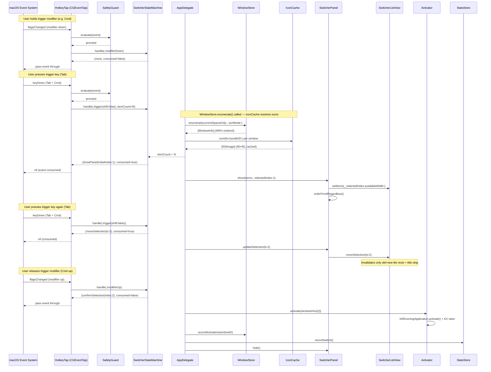
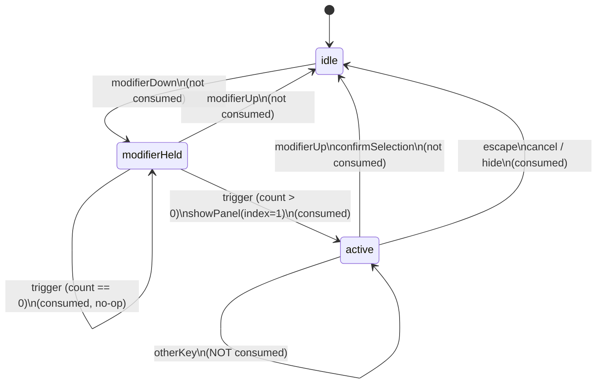

# ShakaPachi — Architecture

## Overview

ShakaPachi is a window-level Cmd+Tab replacement for macOS. It lives exclusively in the menu bar (`LSUIElement = true`, no Dock icon), installs a session-level `CGEventTap` to intercept the configured trigger key (default: Cmd+Tab), and presents a floating horizontal icon-tile row listing every on-screen window in most-recently-used (MRU) order. There are no thumbnails and no previews — response speed is the primary design constraint. Holding the trigger modifier cycles through windows; releasing it raises the selected window via the Accessibility API. The app is built with Swift Package Manager as a single executable target targeting macOS 13+.

---

## Layered Component Map

```mermaid
flowchart TD
    subgraph App
        main["main.swift\n(NSApplication entry)"]
        AD["AppDelegate\n(lifecycle, wiring)"]
        SIC["StatusItemController\n(menu-bar icon + menu)"]
        PM["PermissionManager\n(AX + Screen Recording)"]
    end

    subgraph Input
        HT["HotkeyTap\n(CGEventTap)"]
        SG["SafetyGuard\n(stateless evaluator)"]
        SSM["SwitcherStateMachine\n(pure state machine)"]
    end

    subgraph Core
        WS["WindowStore\n(CGWindowList + MRU)"]
        WI["WindowInfo\n(value model)"]
        IC["IconCache\n(60×60 NSImage cache)"]
        ACT["Activator\n(AX window raise)"]
        SE["SpacesEnumerator\n(private SkyLight)"]
        SS["StatsStore\n(UserDefaults counts)"]
        STR["StreakStats\n(pure streak logic)"]
    end

    subgraph UI
        SP["SwitcherPanel\n(NSPanel, created once)"]
        SLV["SwitcherListView\n(custom-drawn tile row)"]
        TIR["TrayIconRenderer\n(glyph + 4 states)"]
        SW["SettingsWindow\n(NSTabView + SwiftUI)"]
        OW["OnboardingWindow\n(permission cards)"]
        CH["ContributionHeatmap\n(SwiftUI, GitHub-style)"]
        APV["AppearancePreviewView\n(SwiftUI, theme preview)"]
    end

    subgraph Settings
        S["Settings\n(UserDefaults wrapper)"]
        LI["LoginItemManager\n(SMAppService)"]
    end

    main --> AD
    AD --> SIC
    AD --> PM
    AD --> HT
    AD --> SSM
    AD --> SP
    AD --> WS
    AD --> IC
    AD --> ACT
    AD --> SS

    HT --> SG
    HT --> SSM
    SSM --> AD

    AD --> WS
    WS --> WI
    WS --> SE
    AD --> IC

    SIC --> TIR
    SP --> SLV
    SW --> APV
    SW --> CH
    SW --> STR
    SW --> SS
    SW --> OW

    AD --> S
    AD --> LI
    SIC --> PM
```

---

## The Switch Cycle (Hot Path)

One complete trigger-to-confirm sequence:

---

## Switcher State Machine

`SwitcherStateMachine` is a pure, AppKit-free class with three states:

`itemCount` is only consumed on the `modifierHeld → active` transition; all other inputs pass `0`. The `sameAppResolver` closure (injected by `AppDelegate`) walks `lastWindowInfos` to find the next window with the same PID as the currently highlighted window.

---

## Menu-Bar Residency & Tray State

`Info.plist` sets `LSUIElement = true`, which suppresses the Dock icon and prevents the app from appearing in the standard Cmd+Tab application switcher. `AppDelegate.applicationDidFinishLaunching` immediately calls `NSApp.setActivationPolicy(.accessory)` to confirm accessory behavior.

`StatusItemController` owns an `NSStatusItem` and renders the icon by calling `TrayIconRenderer.menuBarImage(for:)`. Four `TrayIconState` cases drive four icon variants (precedence top-to-bottom):

| State | Condition | Icon fill |
|---|---|---|
| `.permission` | Either permission missing | Soft amber |
| `.restricted` | Tap disabled (emergency stop / manual toggle) | Soft coral |
| `.settings` | Settings window is open | Soft blue |
| `.normal` | Everything running | Template (adapts to menu-bar appearance) |

The normal state uses `isTemplate = true` so it automatically inverts in dark/light mode. The three colored states are concrete images where only the front-window fill carries the state color; the outline uses the adaptive `NSColor.labelColor`.

`StatusItemController` listens for the `settingsWindowStateChanged` notification to toggle the blue icon while `SettingsWindow` is open.

---

## Permissions & Onboarding

`PermissionManager` checks two permissions using public Apple APIs:

- **Accessibility** (`AXIsProcessTrusted`) — required for `CGEventTap` (to intercept keys) and `AXUIElement` (to raise a specific window).
- **Screen Recording** (`CGPreflightScreenCaptureAccess`) — required for `kCGWindowName` (window titles) to be populated in `CGWindowListCopyWindowInfo`. Screen content is never captured or stored.

At launch, `AppDelegate` calls `PermissionManager.allPermissionsGranted()`. If either permission is missing, `OnboardingWindow` is shown immediately. `OnboardingWindow` polls permission status every second via a `Timer`, so the cards update live as the user grants permissions in System Settings without requiring a restart (except Screen Recording, which takes effect only after relaunch — the onboarding footer and a "Restart" button make this clear).

`HotkeyTap.enable()` is called only once both permissions are granted. The `SafetyGuard.evaluate` call at the top of every tap callback checks `IsSecureEventInputEnabled()` and passes events through untouched when Secure Input is active (e.g. password fields).

---

## Persistence, Settings & i18n

**Settings** (`Settings.swift`) is a `@MainActor` class backed by `UserDefaults.standard`. Every property uses a custom `@propertyWrapper` (`DefaultsEnum`, `DefaultsBool`, `DefaultsInt`, `DefaultsStringArray`) that writes to `UserDefaults` and posts `.settingsDidChange` on `NotificationCenter` on every set. `AppDelegate` observes this notification and calls `applySettingsChanges()` to propagate live changes — trigger key/modifier to `HotkeyTap`, excluded bundle IDs to `WindowStore`, theme to `NSApp.appearance`.

`SettingsWindow` embeds SwiftUI views via `NSHostingView`. A `SettingsStore: ObservableObject` bridges the `NotificationCenter`-based settings to SwiftUI's `@Published` properties.

**Login item** (`LoginItemManager.swift`) uses `SMAppService.mainApp` (macOS 13+). The app registers itself at first launch (one-time flag in `UserDefaults`) so the default is "launch at login". Subsequent user changes go through `LoginItemManager.setEnabled(_:)`.

**i18n**: `Info.plist` sets `CFBundleDevelopmentRegion = ja` and lists both `ja` and `en` in `CFBundleLocalizations`. All user-visible strings use `NSLocalizedString` with a `comment`. The `ja.lproj/Localizable.strings` is an identity mapping (Japanese base). The `en.lproj/Localizable.strings` provides English translations as an overlay. UI strings in SwiftUI use `Text("...")` (which routes through Bundle.main localizations at runtime).

---

## Stats & Streak

`StatsStore` (`@MainActor`, backed by `UserDefaults`) records three values per confirmed switch: a lifetime total count, a rolling today count (resets at local calendar midnight), and a per-day count dictionary keyed by `"yyyy-MM-dd"` strings. No window or app identity is stored — only aggregate integers.

`StreakStats` (pure enum, no AppKit) computes:
- **Current streak**: consecutive days ending at today (one-day grace period: a streak survives if the user hasn't switched yet today).
- **Longest streak**: longest consecutive run across all recorded days.
- **Level (0–4)**: maps a day's count to an intensity bucket using relative percentile thresholds (p25, p50, p75) computed from the active-day distribution.

`ContributionHeatmap` (SwiftUI) renders a 26-column × 7-row GitHub-style grid covering approximately the last six months. Cells are colored at four accent-opacity levels (0.35 / 0.55 / 0.78 / 1.0) using the user's chosen accent color. The heatmap is embedded in the Stats tab of `SettingsWindow`.

---

## Safety

Four interlocking safety mechanisms protect the user from a stuck event tap:

1. **Emergency stop** (`SafetyGuard.isEmergencyStop`): Ctrl+Option+Cmd+Esc (all three modifiers + Escape) detected inside the tap callback. The tap is disabled synchronously (before `DispatchQueue.main.async`) so the hotkey cannot be re-consumed. The combo itself is never consumed; it passes through to the system.

2. **Deadman switch** (`DeadmanSwitch`, `#if DEBUG` only): a `DispatchSource` timer (default 60 s, configurable via `SHAKAPACHI_DEADMAN_SEC` env var; set to 0 by `make run`) that auto-disables the tap if it has not been explicitly disarmed. Disarmed by `hotkeyTap.disable()` on clean shutdown.

3. **Tap auto-recovery** (`SafetyGuard.reenableTap`): `tapDisabledByTimeout` and `tapDisabledByUserInput` events from the system are caught and used to immediately re-enable the tap — but only when `isEnabled` is `true` (intentional disables are not undone).

4. **Secure Input passthrough** (`SafetyGuard.passthroughSecureInput`): when `IsSecureEventInputEnabled()` returns true (password field, screensaver, etc.), all events pass through untouched — ShakaPachi does not intercept anything while the user is entering credentials.

`SafetyGuard` is a stateless pure enum with no AppKit dependency, making the precedence rules fully unit-testable without a display connection.

---

## Build & Run

Requirements: macOS 13 Ventura or later, Xcode Command Line Tools, a Developer ID Application certificate matching the identity in `Makefile`.

| Target | Command | Notes |
|---|---|---|
| Debug build | `make build` | `swift build` + assembles `.app` + codesigns (debug entitlements) |
| Run | `make run` | `make build` then `open dist/ShakaPachi.app`; deadman set to 0 |
| Release | `make release` | `swift build -c release` + hardened runtime codesign |
| Notarize | `make notarize` | `make release` + `notarytool submit` + `stapler staple` |
| Tests | `make test` | `swift test` |
| Clean | `make clean` | removes `.build/` and `dist/` |

The app requires both **Accessibility** and **Screen Recording** permissions on first launch. `OnboardingWindow` guides the user through granting them. Screen Recording requires a relaunch after granting (macOS TCC restriction).
