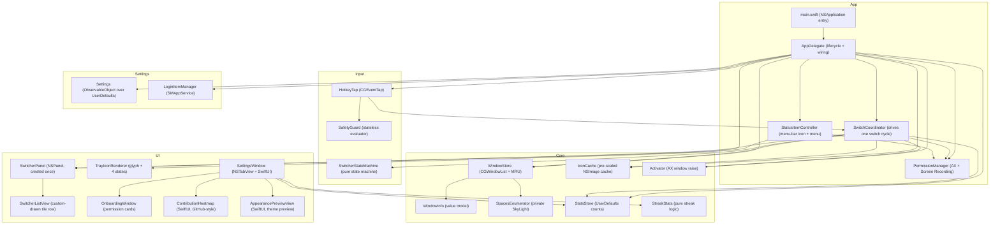
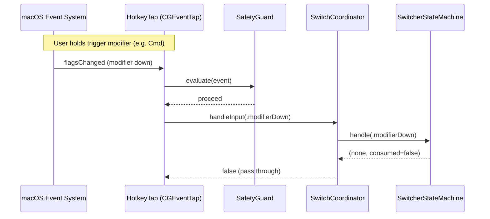
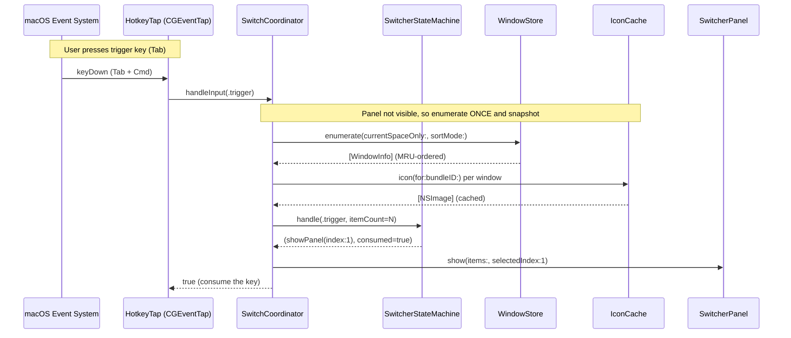
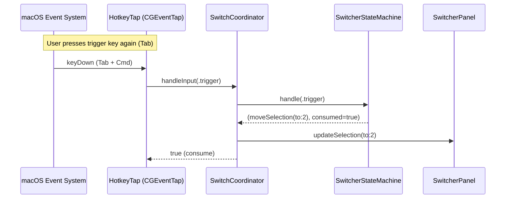
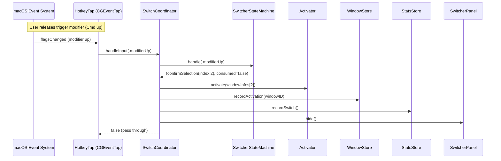
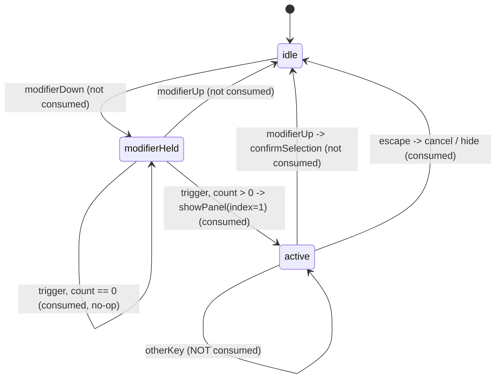

# ShakaPachi — Architecture

This document is written for someone new to Swift and macOS app development. It
explains what the app does, the order in which to read the source, and how the
pieces fit together. The advanced macOS trickery is quarantined at the end — you
can understand the whole app without it.

## Overview

ShakaPachi is a **window-level Cmd+Tab replacement** for macOS. macOS's built-in
Cmd+Tab switches between *applications*; ShakaPachi switches between individual
*windows*. You hold a modifier key (Cmd by default), tap the trigger key (Tab)
to bring up a floating row of app-icon tiles — one per on-screen window, in
most-recently-used order — keep tapping to move the highlight, and release the
modifier to raise the highlighted window.

It runs entirely in the menu bar with no Dock icon. Speed is the primary design
goal, so the tiles show only an app icon and the window title (an optional live
preview of the selected window can be enabled in Settings). The app is a single
Swift Package Manager executable targeting macOS 13+.

---

## Start here — reading order

If you are new to this codebase, read the files in this order. Each line says
what to expect so you know what you are looking at.

1. **`main.swift`** — The entry point. Three lines: create the app, attach the
   delegate, run. Confirms this is a plain AppKit app, not SwiftUI-first.
2. **`App/AppDelegate.swift`** — The **wiring diagram**. It creates every part
   of the app once at launch and connects them together. It also manages
   lifecycle (permissions, the menu-bar item, live settings). After the recent
   refactor it holds *no* switch logic — it only composes and hands off.
3. **`App/SwitchCoordinator.swift`** — The **core**. One file that reads
   top-to-bottom as "what happens from pressing Cmd+Tab to the window coming
   forward." Start with its header comment; it is the best single-file
   introduction to the runtime behaviour. `AppDelegate` builds this object and
   feeds every key event into its `handleInput(_:t0:)` method.
4. **The pure-logic files** (no AppKit, easy to unit-test in isolation):
   - **`Input/SwitcherStateMachine.swift`** — A tiny state machine (idle →
     held → active) that decides what each key press *means* (show, move,
     confirm, cancel). No windows, no drawing — just states and transitions.
   - **`Input/SafetyGuard.swift`** — Stateless rules that decide when the app
     must get out of the user's way (emergency stop, secure input, tap
     recovery). Pure functions returning an enum.
   - **`Core/StreakStats.swift`** — Pure math for the usage streak / heatmap.
     Nothing to do with switching windows; safe to skim last.
5. **The UI parts** — `UI/SwitcherPanel` (the floating window), plus
   `UI/SettingsWindow`, `UI/OnboardingWindow`, and the custom-drawn views. Read
   these once you understand the flow above; they are driven *by* the coordinator
   and the delegate, not the other way around.

The rest of `Core/` (`WindowStore`, `Activator`, `SpacesEnumerator`, `IconCache`)
is the machinery the coordinator drives. `WindowStore` and `Activator` are worth
reading; `SpacesEnumerator` and the private-API details are covered in the
**Advanced** section and can be skipped on a first pass.

---

## Reading the Swift concurrency annotations

You will see these annotations all over the entry files. On a first read, treat
them as the compiler being reassured about threading — the actual behaviour lives
in the method bodies, not these labels. Here is what each one means so you can
skim past it.

| Annotation | Plain meaning | On a first read |
|---|---|---|
| `@MainActor` | Runs on the main (UI) thread | Assume "this is main-thread code; no extra threading to worry about" |
| `nonisolated` / `nonisolated(unsafe)` | Opts a member out of the main-thread rule; `(unsafe)` means the author has manually ensured it is safe | Skip; it is a concurrency escape hatch |
| `MainActor.assumeIsolated { }` | "We are already on the main thread here, trust me" | Skip; it is a promise to the compiler |
| `@Sendable` / `@unchecked Sendable` | Safe to hand across threads; `unchecked` means the author guarantees it by hand | Skip |
| `@propertyWrapper` (e.g. `DefaultsBool`, `DefaultsEnum`) | A reusable wrapper that makes a property auto-read/write `UserDefaults` | Read it once, then treat wrapped properties as plain values |
| `nonmutating set` | A setter that writes elsewhere (UserDefaults) instead of mutating the struct | Skip; behaves like a normal property to callers |
| `[weak self]` | Standard closure hygiene to avoid a retain cycle | Skip |

For a first look at pure logic with none of these annotations, go straight to
`SwitcherStateMachine`, `SafetyGuard`, and `StreakStats`.

---

## What happens when you press Cmd+Tab

Here is the whole flow in plain language. A few terms are explained inline the
first time they appear.

1. **You hold Cmd.** A low-level *event tap* (`HotkeyTap` — a system hook that
   sees key events before the focused app does) notices the modifier going down.
   Nothing visible happens yet.
2. **You tap Tab.** The event tap translates this into an abstract "trigger"
   input and hands it to the coordinator. The coordinator asks `WindowStore` to
   *enumerate* (list) every on-screen window **once**, builds a tile for each
   (app icon + title), and shows the floating panel with the second window
   pre-selected — so a single tap-and-release returns you to the previous window.
3. **You keep tapping Tab (still holding Cmd).** Each tap moves the highlight one
   tile to the right, wrapping around at the end. Shift+Tab moves left; arrow
   keys work too. Crucially, the window list does **not** get rebuilt — the panel
   keeps showing the *snapshot* taken in step 2 (see "why we snapshot" below).
4. **You release Cmd.** That confirms the highlighted window. The coordinator
   asks `Activator` to raise it (bring it to the front), records the choice so
   it sorts to the top next time, bumps the switch counter, and hides the panel.
   Pressing Escape instead cancels — the panel just hides, nothing is raised.

**Why the panel returns quickly must be treated as sacred:** the coordinator's
`handleInput` runs *inside* the event-tap callback on the main thread, which the
system expects to return almost instantly. So it only does cheap work (a state
lookup and a redraw request) and never blocks. Its return value tells the tap
whether to *consume* the key (swallow it so the front app never sees it) or let
it pass through.

---

## Layered component map

Boxes are grouped by folder. `AppDelegate` wires everything; `SwitchCoordinator`
sits between the low-level input and the switch-cycle parts it drives.

The **pure-logic** parts (`SwitcherStateMachine`, `SafetyGuard`, `StreakStats`,
plus the static helpers inside `WindowStore` / `Activator`) have no AppKit
dependency, so they are unit-tested directly without a display connection.

---

## The switch cycle (hot path)

One complete trigger-to-confirm sequence, shown as four small diagrams — one per
phase — matching the four numbered steps in "What happens when you press Cmd+Tab"
above (1:1). `SwitchCoordinator.handleInput` is the orchestrator: `HotkeyTap`
calls it for every relevant key event, and it executes whatever the state machine
decides.

**Phase 1 — Hold Cmd (arm).** You hold the trigger modifier; the tap is armed but nothing is shown yet.

**Phase 2 — Tap Tab (show).** You tap Tab; the coordinator enumerates windows once, snapshots them, and shows the panel with the second window pre-selected.

**Phase 3 — Keep tapping Tab (move).** You tap Tab again; the highlight moves over the existing snapshot with no re-enumeration.

**Phase 4 — Release Cmd (confirm).** You release the modifier; the coordinator raises the window, records it, bumps the counter, and hides the panel.

### Why we snapshot at show time

When the panel first appears, the coordinator enumerates the windows **exactly
once** and keeps that list as the single source of truth for the rest of the
cycle. Two derived lists are stored:

- `lastWindowInfos` — the full window data, used at confirm time to raise the
  exact window, and by the same-app jump helper.
- `lastSwitcherItems` — the display rows the panel renders.

Both describe the same windows in the same order, so the highlighted index is
always valid against both. If the app re-enumerated on every key press instead,
windows opening or closing mid-cycle could shift the indices out from under the
panel the user is still looking at. Enumerate-once avoids that whole class of
bug and keeps each key press cheap.

---

## Switcher state machine

`SwitcherStateMachine` is a pure, AppKit-free class with three states. It decides
*what a key press means*; the coordinator carries out the resulting action.

The window count is only meaningful on the `modifierHeld → active` (show)
transition; every other input passes `0` and the machine ignores it. The
`sameAppResolver` closure — wired by the coordinator to walk its `lastWindowInfos`
snapshot — finds the next window belonging to the same app as the highlighted one.

---

## Menu-bar residency and tray state

`Info.plist` sets `LSUIElement = true`, which hides the Dock icon and keeps the
app out of the standard Cmd+Tab application switcher.
`AppDelegate.applicationDidFinishLaunching` also calls
`NSApp.setActivationPolicy(.accessory)` to confirm accessory behaviour.

`StatusItemController` owns the menu-bar `NSStatusItem` and draws its icon via
`TrayIconRenderer.menuBarImage(for:)`. Four `TrayIconState` cases map to four
icon variants (precedence top-to-bottom):

| State | Condition | Icon fill |
|---|---|---|
| `.permission` | Either permission missing | Soft amber |
| `.restricted` | Tap disabled (emergency stop / manual toggle) | Soft coral |
| `.settings` | Settings window is open | Soft blue |
| `.normal` | Everything running | Template (adapts to menu-bar appearance) |

The normal state uses `isTemplate = true` so it inverts automatically in
dark/light mode. The three coloured states are concrete images where only the
front-window fill carries the state colour; the outline uses the adaptive
`NSColor.labelColor`. `StatusItemController` listens for the
`settingsWindowStateChanged` notification to toggle the blue icon while the
Settings window is open.

---

## Permissions and onboarding

`PermissionManager` checks two permissions using public Apple APIs:

- **Accessibility** (`AXIsProcessTrusted`) — required for the event tap (to
  intercept keys) and for `AXUIElement` (to raise a specific window).
- **Screen Recording** (`CGPreflightScreenCaptureAccess`) — required so that
  window titles (`kCGWindowName`) are populated in `CGWindowListCopyWindowInfo`,
  and for the optional live window preview. Screen content is never captured or
  stored otherwise.

At launch `AppDelegate` calls `PermissionManager.allPermissionsGranted()`. If
either permission is missing, `OnboardingWindow` is shown. It polls permission
status once a second via a `Timer`, so the cards update live as the user grants
access in System Settings — no restart needed, except Screen Recording, which
macOS applies only after a relaunch (the onboarding footer and a "Restart" button
make this clear).

The event tap is enabled only once both permissions are granted (see
`startTapIfPossible`, which is also where the `SwitchCoordinator` is created and
wired to the tap). On every tap callback, `SafetyGuard.evaluate` runs first and
passes events through untouched when Secure Input is active (e.g. password
fields).

---

## Persistence, settings and i18n

**Settings** (`Settings.swift`) is a `@MainActor` `ObservableObject` backed by
`UserDefaults.standard`. Each property uses a small `@propertyWrapper`
(`DefaultsEnum`, `DefaultsBool`, `DefaultsInt`, `DefaultsStringArray`) that reads
and writes `UserDefaults` and posts `.settingsDidChange` on `NotificationCenter`
on every set.

There is **no separate mirror object** — SwiftUI views bind directly to
`Settings.shared`. The `objectWillChange` publisher is driven from the same
`.settingsDidChange` notification every setter emits (see the observer wired in
`Settings.init`), so SwiftUI re-reads fresh values without an extra bridge type.
`AppDelegate` also observes `.settingsDidChange` and calls `applySettingsChanges()`
to propagate live changes: trigger key/modifier to `HotkeyTap`, excluded bundle
IDs to `WindowStore`, and theme to `NSApp.appearance`.

**Login item** (`LoginItemManager.swift`) uses `SMAppService.mainApp` (macOS
13+). The app registers itself once at first launch (a one-time flag in
`UserDefaults`) so the default is "launch at login"; later changes go through
`LoginItemManager.setEnabled(_:)`.

**i18n**: `Info.plist` sets `CFBundleDevelopmentRegion = ja` and lists both `ja`
and `en` in `CFBundleLocalizations`. User-visible strings use
`NSLocalizedString` with a `comment`. `ja.lproj/Localizable.strings` is the
Japanese base (identity mapping); `en.lproj/Localizable.strings` overlays English.
SwiftUI `Text("...")` routes through the bundle localizations at runtime. The
chosen language is written to the `AppleLanguages` UserDefaults key and applies
on the next launch.

---

## Stats and streak

`StatsStore` (`@MainActor`, `UserDefaults`-backed) records three values per
confirmed switch: a lifetime total, a rolling today count (resets at local
calendar midnight), and a per-day dictionary keyed by `"yyyy-MM-dd"`. No window
or app identity is stored — only aggregate integers.

`StreakStats` (pure enum, no AppKit) computes:

- **Current streak** — consecutive active days ending at today, with a one-day
  grace period (the streak survives if the user hasn't switched *yet* today).
- **Longest streak** — the longest consecutive run across all recorded days.
- **Level (0–4)** — maps a day's count to an intensity bucket using relative
  percentile thresholds (p25, p50, p75) over the active-day distribution.

`ContributionHeatmap` (SwiftUI) renders a GitHub-style grid (~last six months),
colouring cells at four accent-opacity levels using the user's accent colour. It
lives in the Stats tab of `SettingsWindow`.

---

## Safety

Four interlocking mechanisms protect the user from a stuck event tap:

1. **Emergency stop** (`SafetyGuard.isEmergencyStop`): Ctrl+Option+Cmd+Esc,
   detected inside the tap callback. The tap is disabled synchronously so the
   hotkey cannot be re-consumed. The combo itself is never consumed — it passes
   through to the system.
2. **Deadman switch** (`DeadmanSwitch`, `#if DEBUG` only): a `DispatchSource`
   timer (default 60 s, configurable via `SHAKAPACHI_DEADMAN_SEC`; set to 0 by
   `make run`) that auto-disables the tap unless it is explicitly disarmed on
   clean shutdown.
3. **Tap auto-recovery** (`SafetyGuard.tapRecoveryResult`): `tapDisabledByTimeout`
   / `tapDisabledByUserInput` events from the system are caught and used to
   re-enable the tap — but only when the tap is *meant* to be enabled
   (intentional disables are not undone).
4. **Secure Input passthrough** (`SafetyGuard.evaluate` → `passthroughSecureInput`):
   when `IsSecureEventInputEnabled()` is true (password field, screensaver,
   etc.), all events pass through untouched.

`SafetyGuard` is a stateless pure enum with no AppKit dependency, so its
precedence rules are fully unit-testable without a display connection.

---

## Advanced: how the tricky macOS bits work

**Beginners can skip this section.** macOS provides no clean, public API for the
three things below, so ShakaPachi uses well-known private/low-level calls that
larger tools (AltTab, Hammerspoon, yabai) rely on too. This complexity is
essential — there is no supported alternative that does the same job — so it is
isolated here rather than spread through the codebase.

- **Intercepting keys before the front app (`CGEventTap`, in `HotkeyTap`).** A
  session-level event tap is the only way to see and swallow Cmd+Tab before the
  focused app reacts. It requires Accessibility permission and cannot run in a
  sandbox, which is why the app can never be sandboxed or shipped on the App
  Store. Everything in the Safety section exists to keep this tap from ever
  locking up the keyboard.

- **Raising one specific window (`_AXUIElementGetWindow`, in `Activator`).**
  There is no public API to map a `CGWindowID` (what the window list gives us) to
  the Accessibility element you must poke to raise that exact window. The private
  `_AXUIElementGetWindow` provides that mapping directly. Because it is
  undocumented and could change between macOS versions, `Activator` falls back to
  matching by window title and then by on-screen bounds, and finally to
  activating just the app, if the private call ever fails.

- **Listing windows on other Spaces (SkyLight `CGS*`, in `SpacesEnumerator`).**
  The public `CGWindowList` does not reliably return windows on other Mission
  Control Spaces and gives no Space attribution. `SpacesEnumerator` wraps the
  private `CGSCopyManagedDisplaySpaces` / `CGSCopySpacesForWindows` calls to get
  real all-Spaces results, used only when the user turns off "current Space only."
  Every private call is wrapped defensively: any unexpected result makes the
  module return `nil` so the caller falls back to the public behaviour — no crash,
  no hang.

---

## Build and run

Requirements: macOS 13 Ventura or later, Xcode Command Line Tools, and a
Developer ID Application certificate matching the identity in `Makefile`.

| Target | Command | Notes |
|---|---|---|
| Debug build | `make build` | `swift build` + assembles `.app` + codesigns (debug entitlements) |
| Run | `make run` | `make build` then `open dist/ShakaPachi.app`; deadman set to 0 |
| Release | `make release` | `swift build -c release` + hardened runtime codesign |
| Notarize | `make notarize` | `make release` + `notarytool submit` + `stapler staple` |
| Tests | `make test` | `swift test` |
| Clean | `make clean` | removes `.build/` and `dist/` |

The app requires both **Accessibility** and **Screen Recording** permissions on
first launch; `OnboardingWindow` guides the user through granting them. Screen
Recording takes effect only after a relaunch (a macOS TCC restriction).
